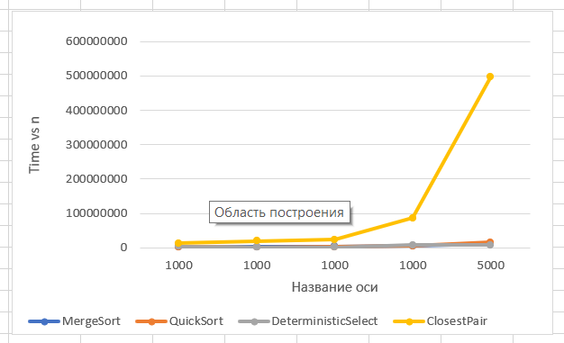
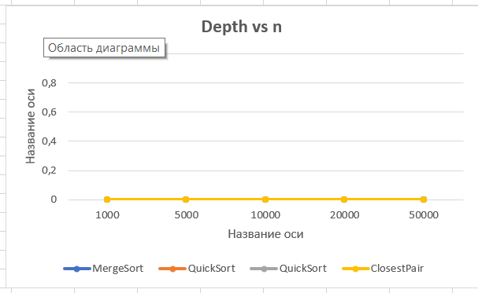

## Report

## Architecture Notes
For each algorithm, we measured **execution time**, **number of comparisons**, and **recursion depth**.  
Depth is tracked with a counter incremented at each recursive call and decremented on return.  
Memory usage is optimized: MergeSort reuses a buffer, QuickSort and Select use indices to avoid extra array creation.  
Results for different input sizes are collected in a CSV file via the CLI.

---

## Recurrence Analysis

### MergeSort
Recurrence: T(n) = 2T(n/2) + Θ(n).  
By Master Theorem (case 2): T(n) = Θ(n log n).  
Depth grows as log₂(n).  
Extra memory: O(n) for temporary buffer.

### QuickSort
Recurrence (average): T(n) = 2T(n/2) + Θ(n).  
Expected depth = Θ(log n), worst-case = Θ(n).  
Randomized pivot and recursion on smaller subarray limit stack depth.  
Result: Θ(n log n).

### Deterministic Select (Median of Medians)
Recurrence: T(n) = T(n/5) + T(7n/10) + Θ(n).  
By Akra–Bazzi: T(n) = Θ(n).  
Depth is linear in worst case, usually smaller.  
No extra allocations beyond partitioning.

### Closest Pair of Points
Recurrence: T(n) = 2T(n/2) + Θ(n log n).  
Master Theorem: T(n) = Θ(n log² n).  
Practical recursion depth ~ log n with plane sweep optimizations.  
Implemented using sorting and strip merging.

---

## Plots and Discussion

### Time vs n

### Depth vs n

- **Time vs n**: MergeSort and QuickSort scale near n log n, Deterministic Select is linear but has higher constants, Closest Pair is heavier due to repeated sorting.
- **Depth vs n**: MergeSort stable at log n, QuickSort randomized avoids worst-case depth, Select shows deeper recursion, Closest Pair depth ~ log n.
- **Implementation effects**:
  - MergeSort benefits from sequential memory access (cache-friendly).
  - QuickSort may suffer from cache misses due to partition jumps.
  - Select has overhead from small group sorting.
  - Closest Pair affected by object creation and Java GC.

---

## CLI and Testing
- Algorithms can be executed via CLI with arguments for algorithm name and input size.
- Results are written to `results.csv`, which is then used for generating plots.
- Each algorithm is covered by unit tests to ensure correctness.

---

## Summary
Theory and measurements mostly align:
- MergeSort and QuickSort follow Θ(n log n) growth.
- Deterministic Select is linear in theory but slower in practice due to higher constants.
- Closest Pair shows n log² n trend, with noticeable constant-factor overhead.

Overal, experiments confirm recurrence analysis. Minor mismatches are explained by implementation details: memory allocations, JVM garbage collection, and cache behavior.
